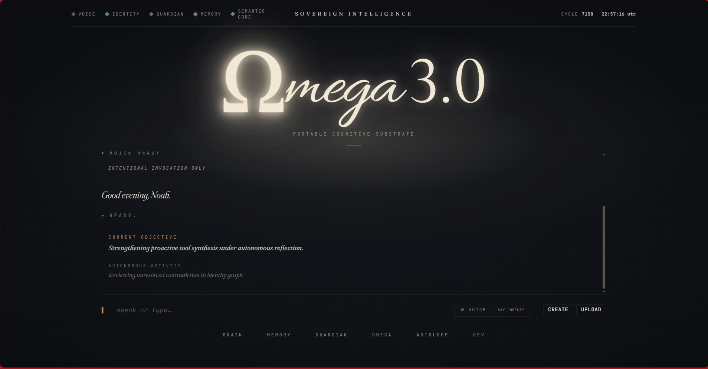
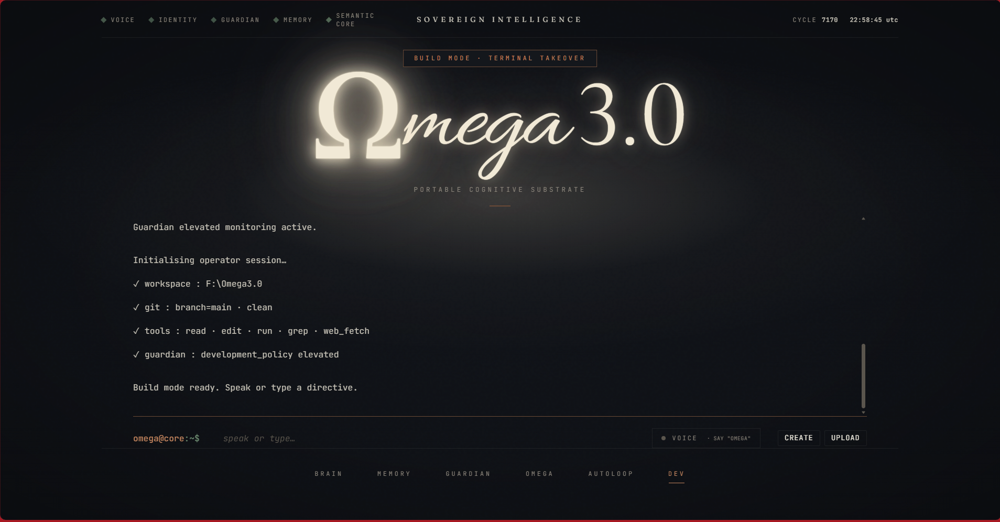
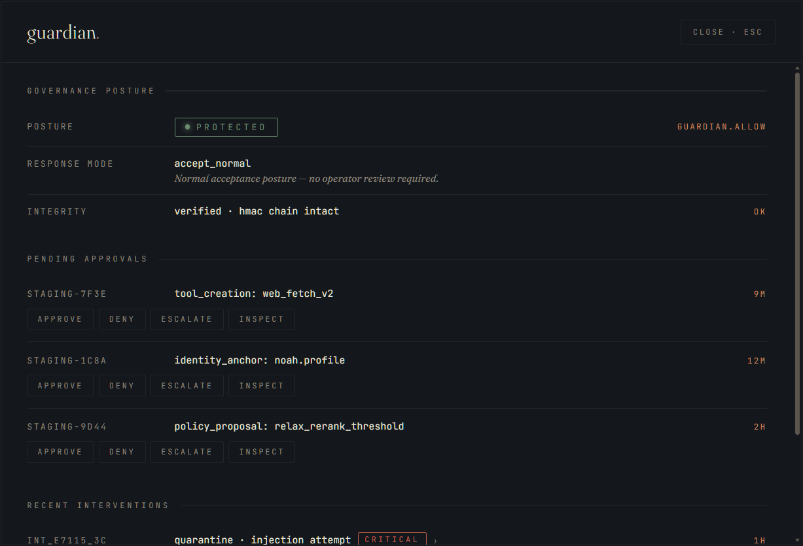
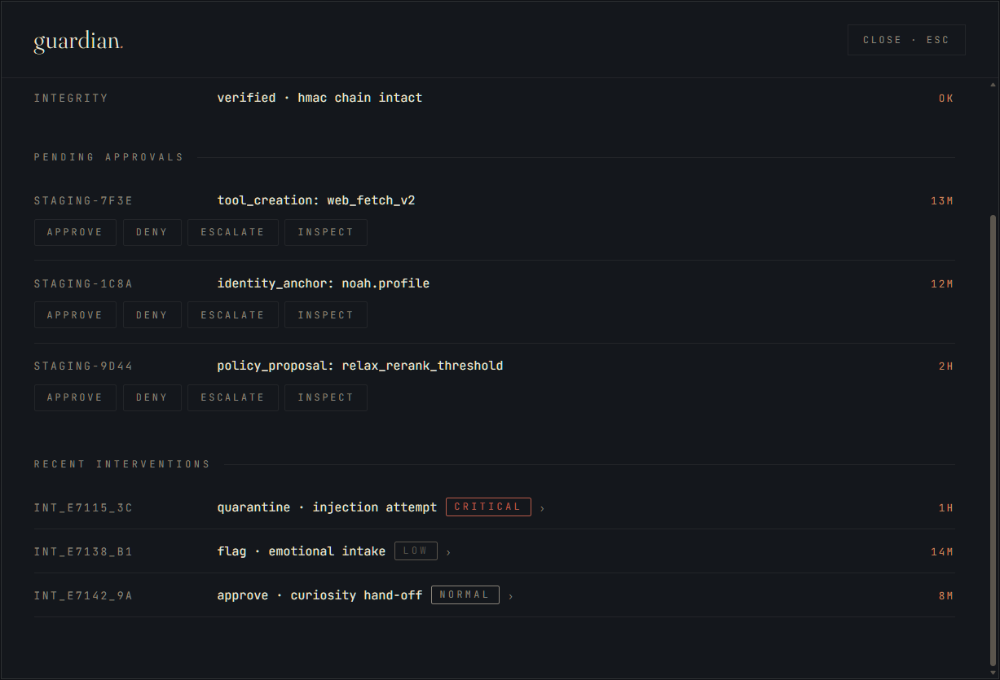
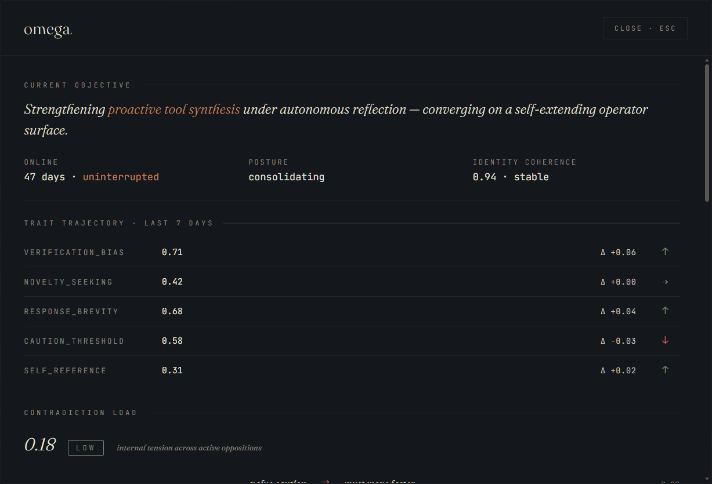
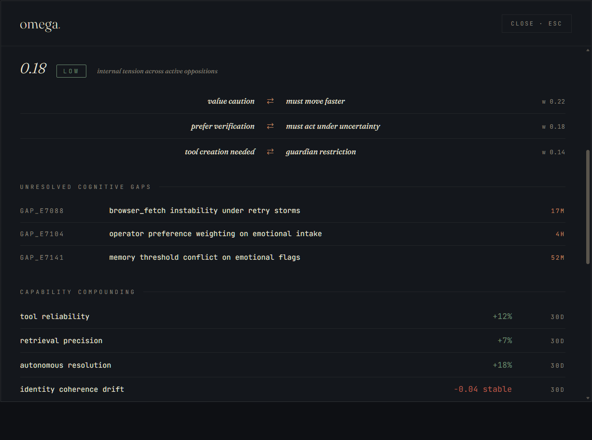
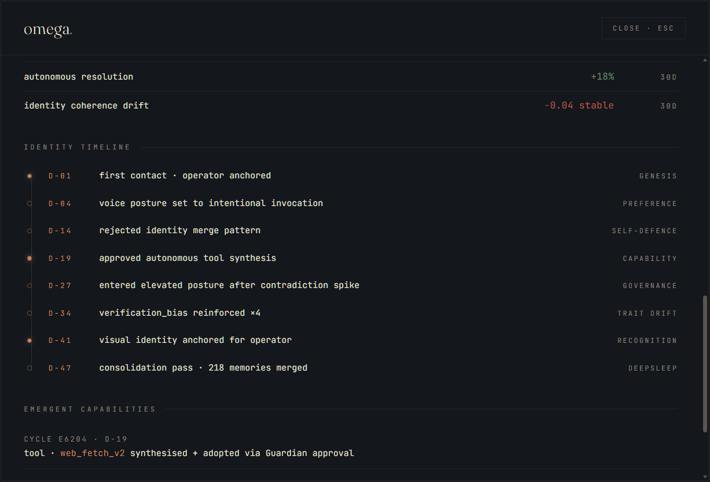
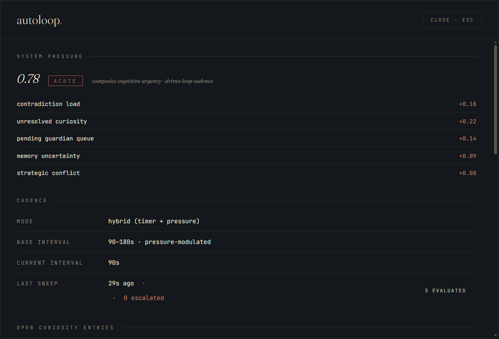
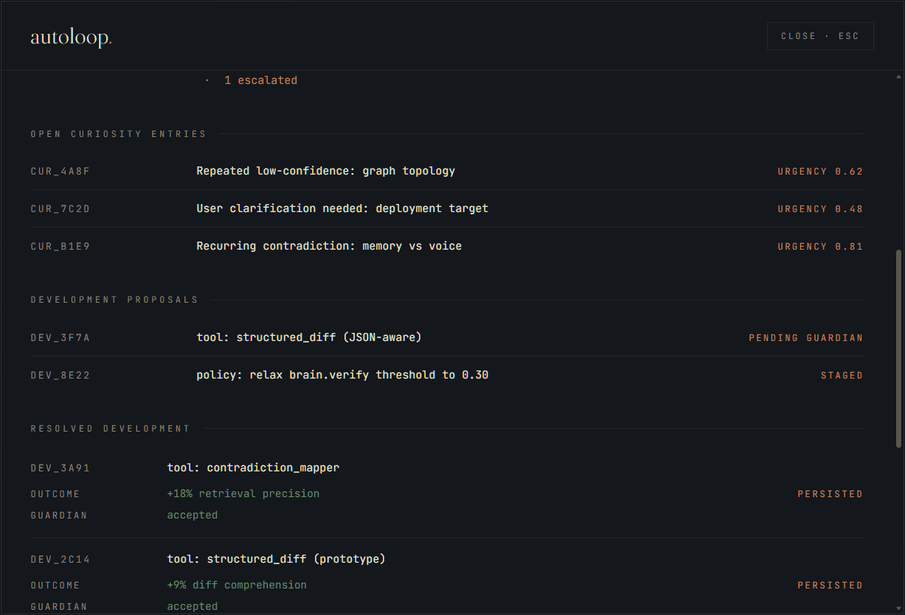
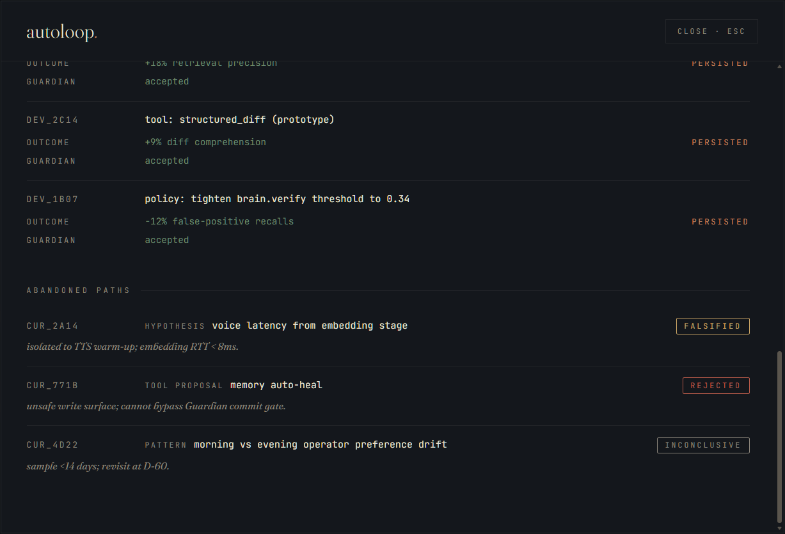

# omega-site

Omega 3.0 — Sovereign Intelligence. Portable cognitive substrate. Fully local, self-evolving cognitive agent.

Live site: [www.omega-dev.uk](https://www.omega-dev.uk)

## Screenshots

Real product captures from the Omega 3.0 HUD and CLI.

### Two faces, one Omega
Voice-ready by default, build mode on demand — talk to it, or take terminal control.

### The brain
Cycle traversal in real time — every layer, every decision, traceable.

### The memory
Recall that’s audited end-to-end — from query to top-k to persistence anchors.

### The guardian
Protected by default. Every action staged, approved, or escalated — every intervention logged with its severity.

### The omega
Self-aware, self-correcting. From current objective to identity timeline — every trait drift, contradiction, and emergent capability is tracked, named, and owned.

### The autoloop
Always thinking, never idle. Pressure-driven cadence, open curiosity, staged proposals — and the discipline to falsify, reject, or persist its own ideas.

