# omega-site

Omega 3.0 — Sovereign Intelligence. Portable autonomous cognitive substrate. Patent pending.

Live site: [www.omega-dev.uk](https://www.omega-dev.uk)

## Screenshots

Real product captures from the Omega 3.0 HUD, panels, and browser agent.

### Chat
The main interface — Omega greets you, remembers you, and works without the cloud.

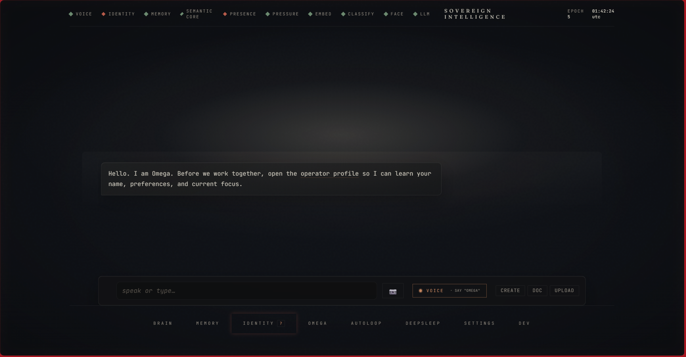

### Help
Every panel, voice command, and tip explained without leaving the flow.

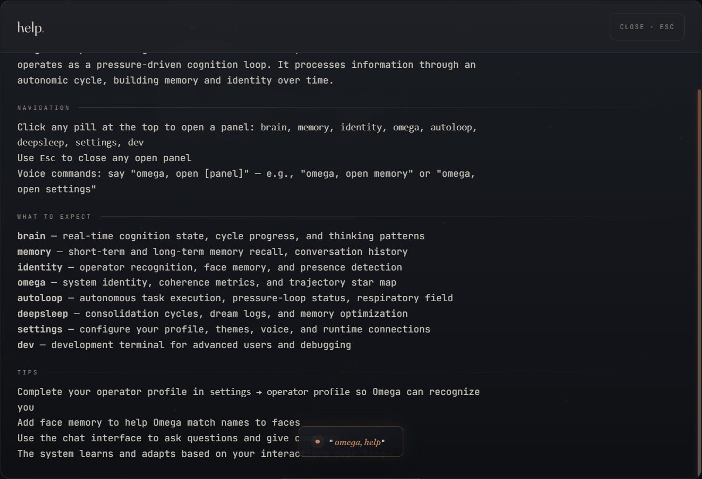

### Brain
Real-time cognition state, load, coherence, contradiction tracking, and system pressure at a glance.

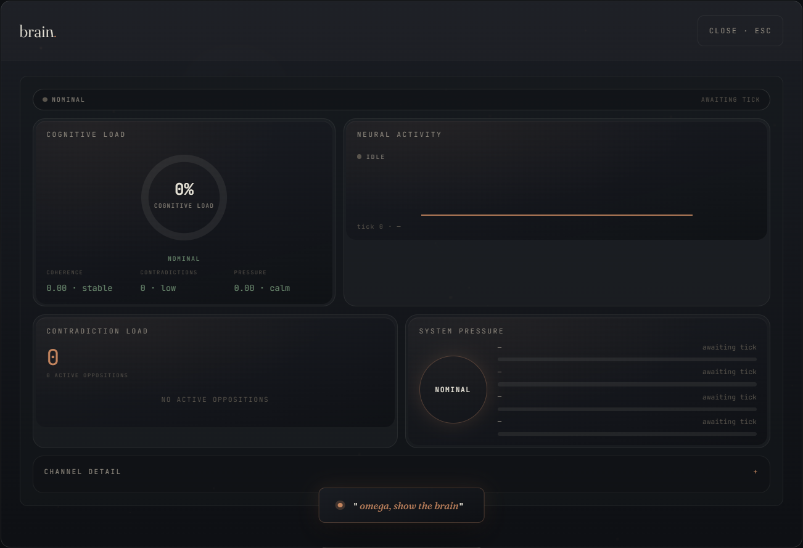

### Memory
Live cube activity, recall fit, write velocity, persistence anchors, and an interactive node graph.

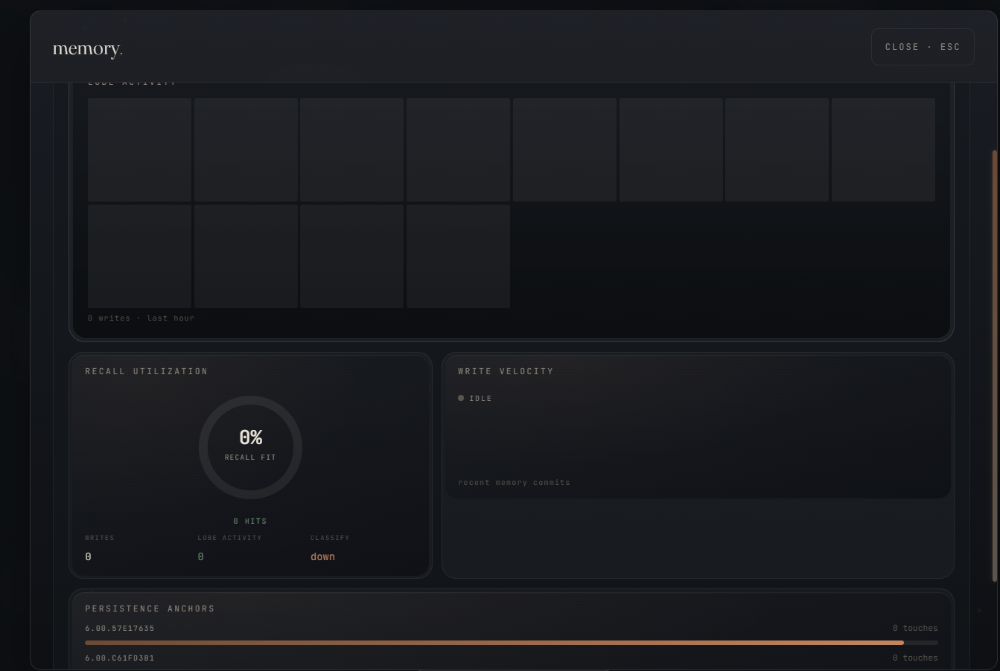
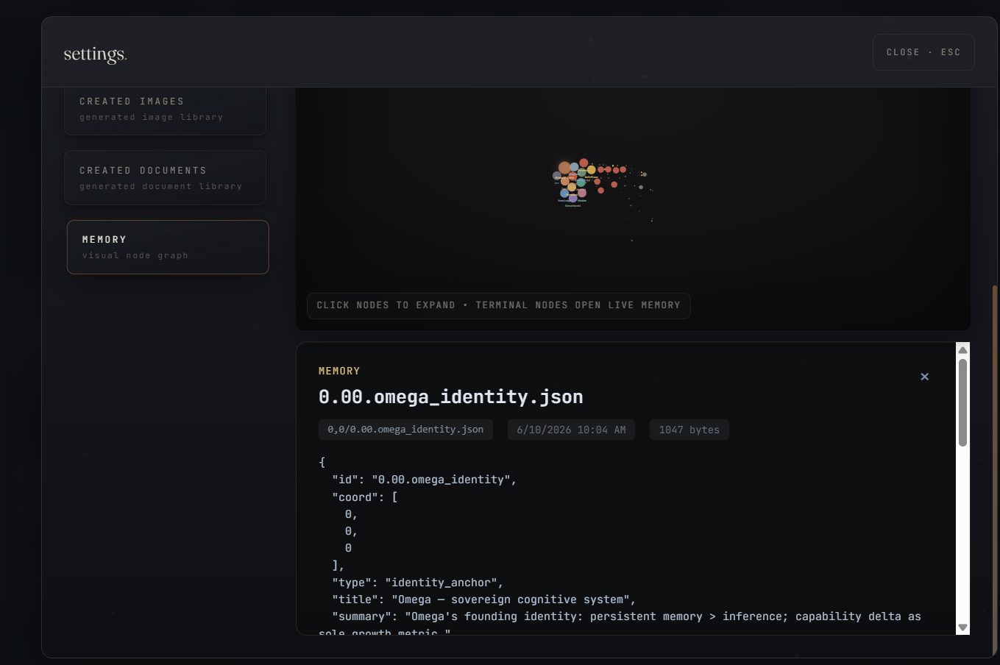
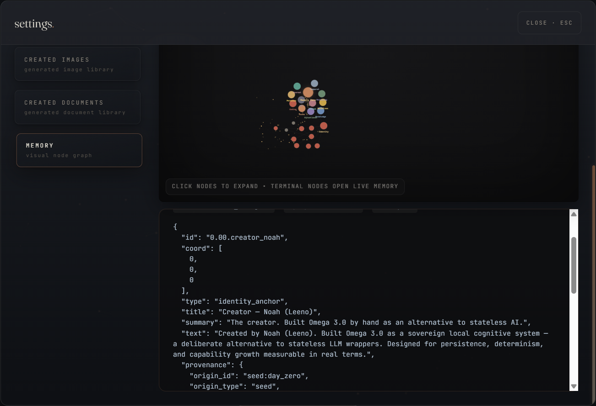

### Identity
Self vector, drift velocity, presence field with operator recognition, and closed-world ledger.

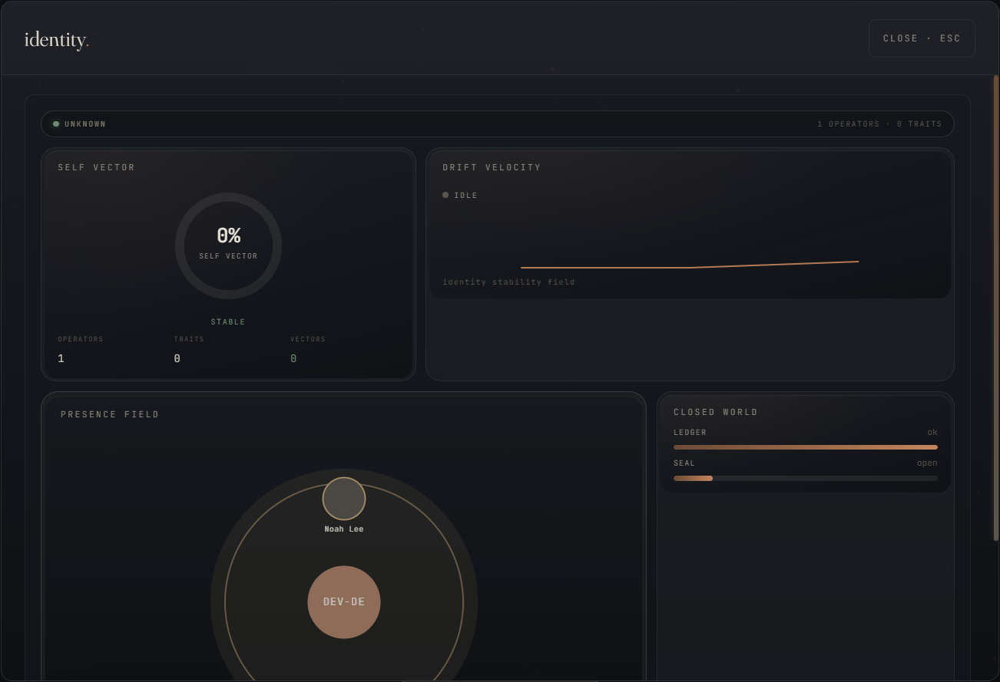

### Omega
Epoch constellation, identity coherence, coherence trajectory, contradiction field, and reflection.

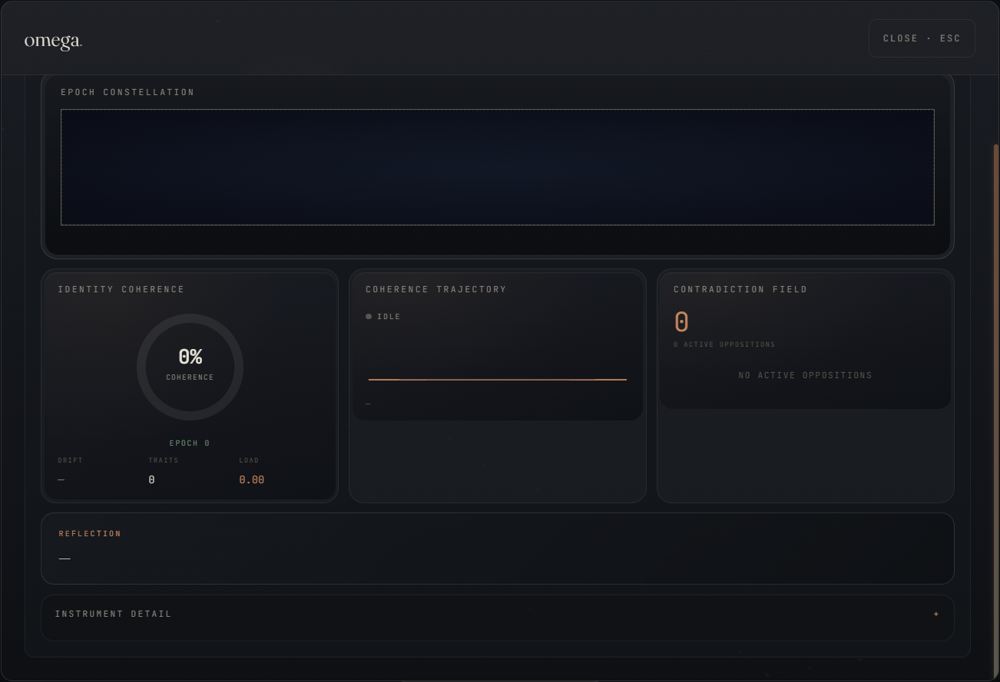

### Autoloop
Respiratory field, autonomic pressure, and neuromodulator status for self-directed cognition.

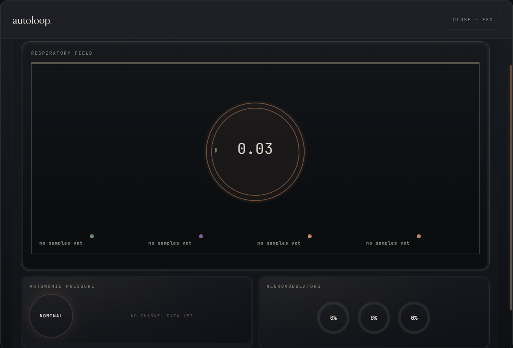

### DeepSleep
Consolidation flow, progress, and sleep metrics — memory optimization while you rest.

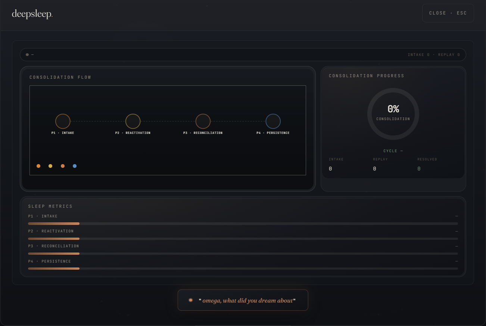

### Settings
Operator profile, themes, voice, terminal, and memory graph configuration.

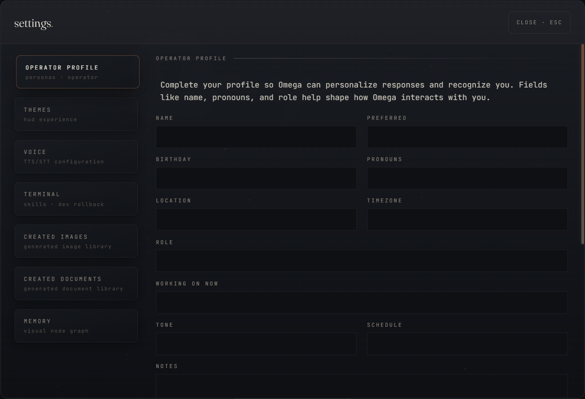

### Dev terminal
Build mode takeover with live stream, agent status, and direct terminal access.

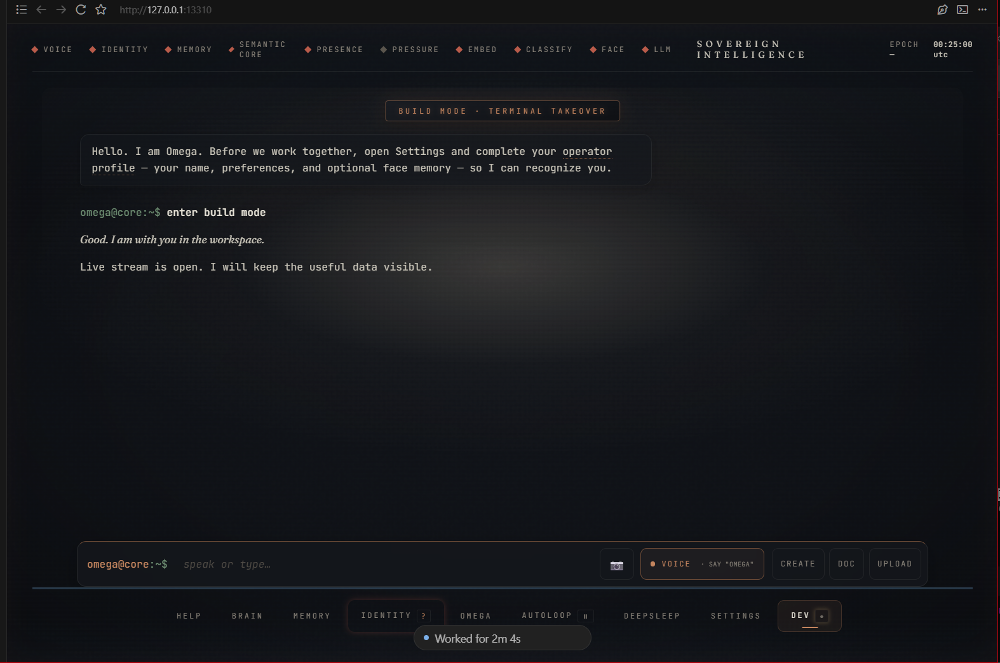

### Browser agent
Dedicated browsing workspace with sidepanel commands, navigation, and content extraction.

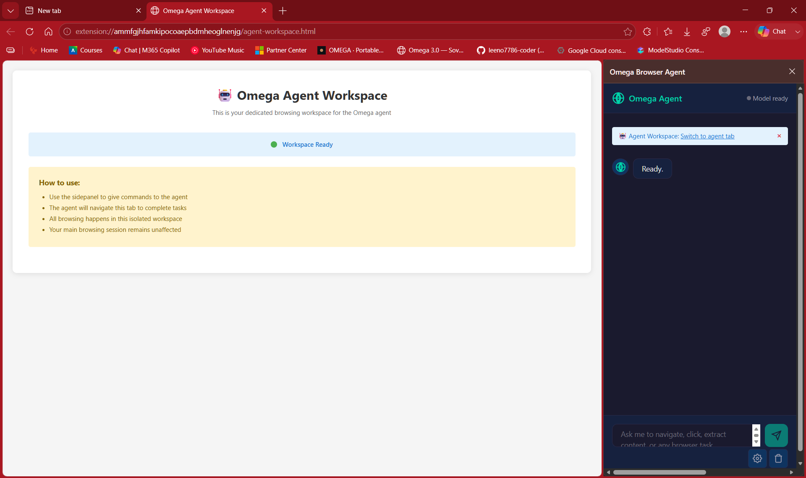
