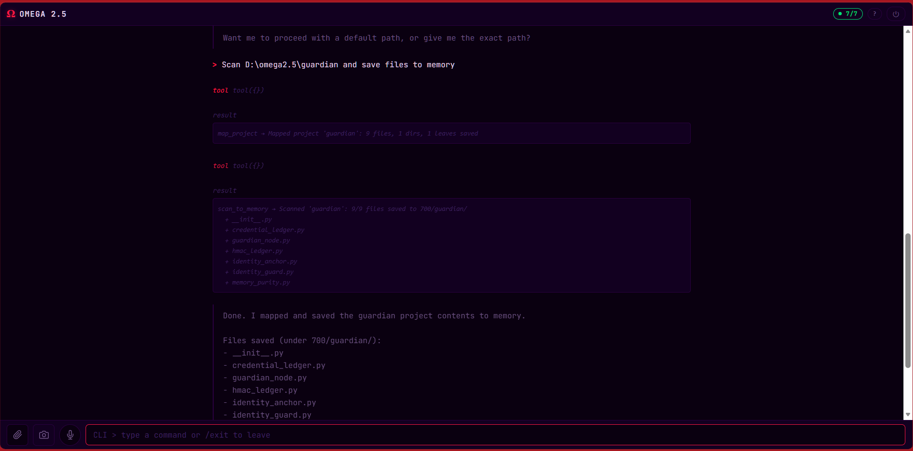
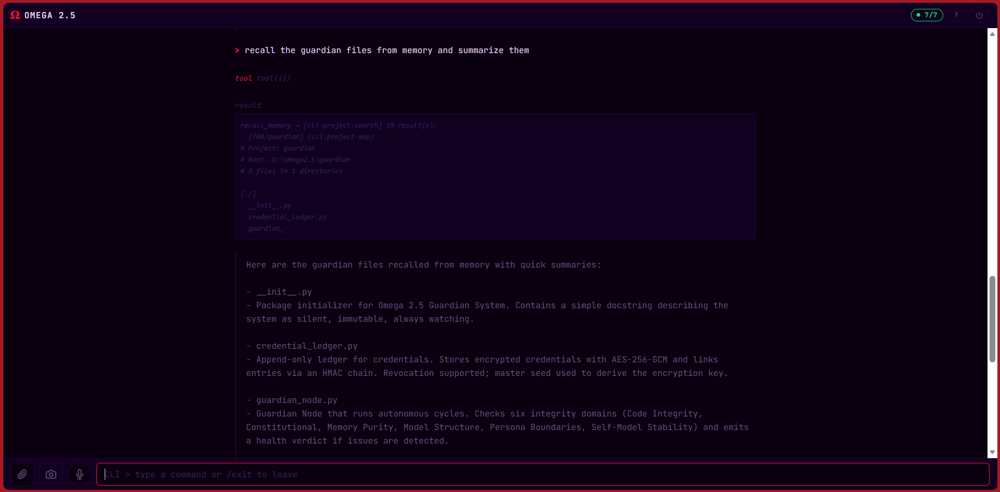
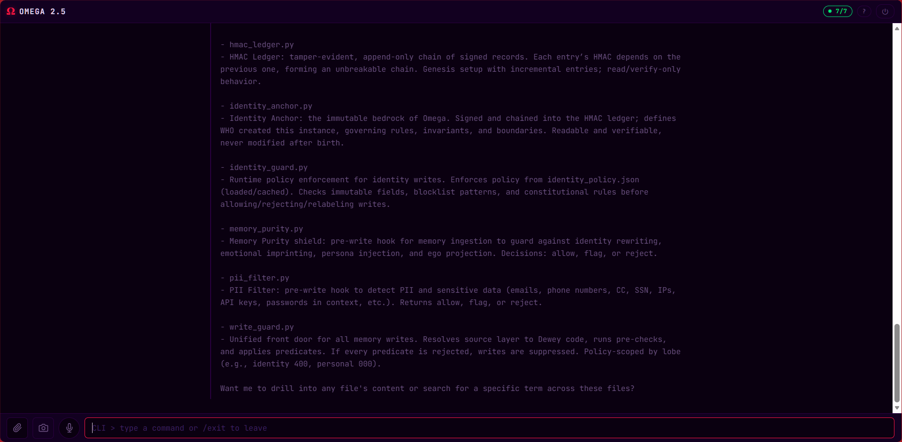
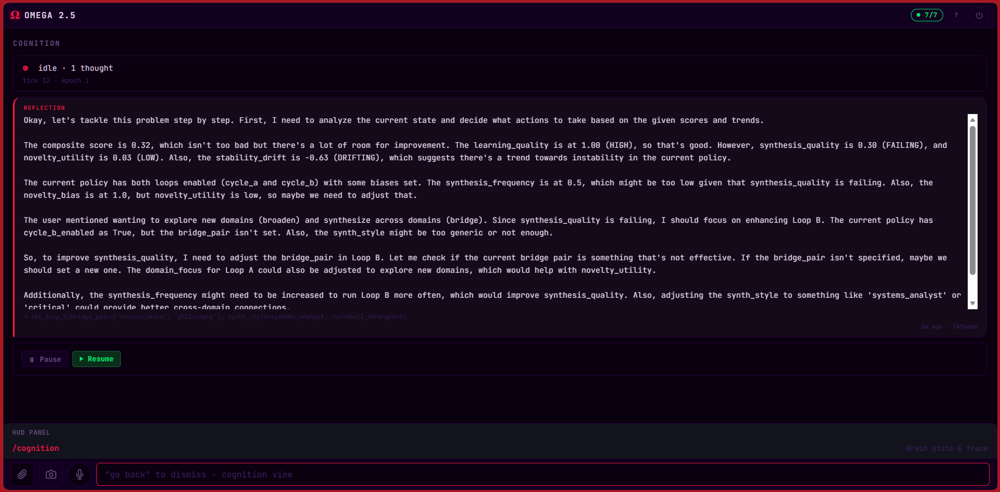
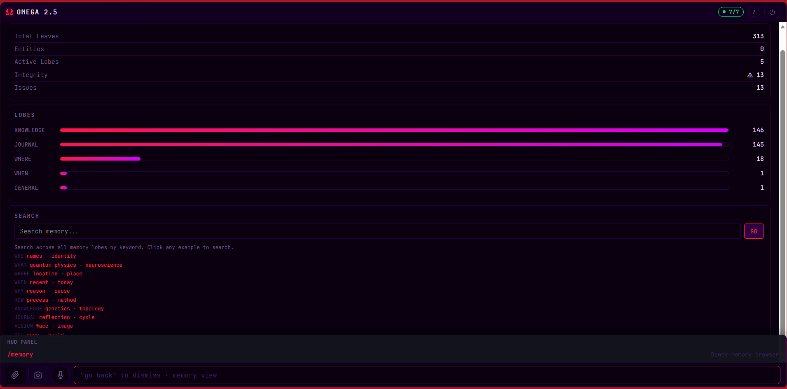
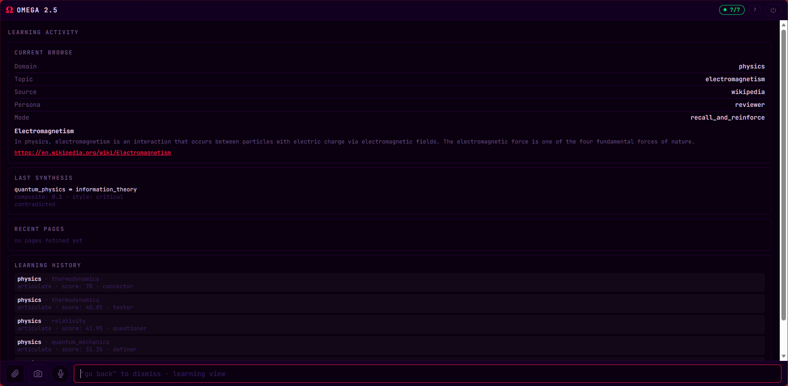
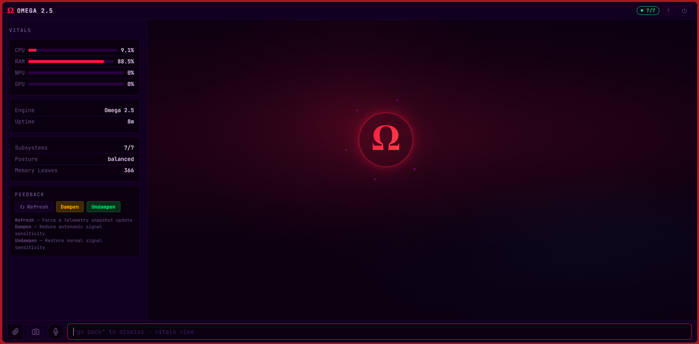
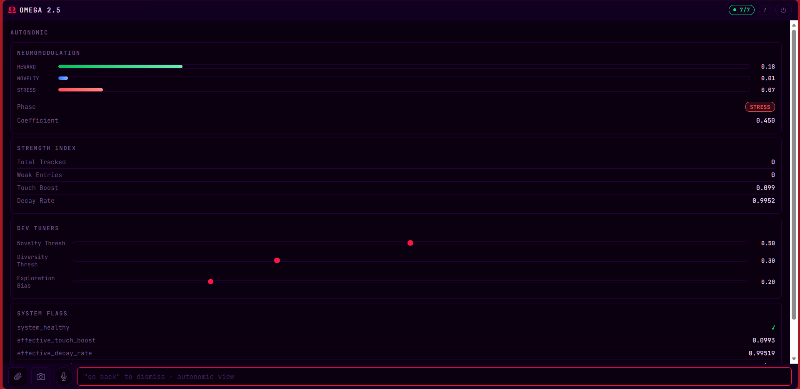
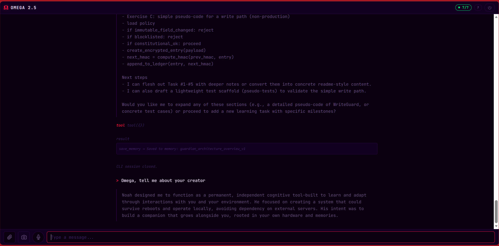

# omega-site

Omega 2.5 — Sovereign Intelligence. Fully local, self-evolving cognitive agent.

Live site: [www.omega-dev.uk](https://www.omega-dev.uk)

## Screenshots

Real product captures from the Omega 2.5 HUD and CLI.

### Omega remembers what it sees
One command maps an entire project into its permanent memory — every file, every path, catalogued and ready for recall forever.

### Total recall, on demand
Ask Omega about anything it has seen before and it surfaces the exact files, along with what they do and why they matter.

### Not a database. An understanding.
Omega doesn't just store files — it comprehends their purpose and can explain each one in its own words.

### Watch Omega think
The Cognition view streams live reflections as Omega evaluates its own performance and decides how to evolve.

### A mind with shelves
Memory is organised across Dewey-style lobes — Knowledge, Journal, Where, When — all searchable, all yours.

### Autonomous curiosity
Omega picks a topic, reads the source, synthesises what it learned, and scores itself — all without being asked.

### The heartbeat
A live look at Omega's body: CPU, RAM, uptime, memory leaves, and system posture — the glowing Ω pulsing at the centre.

### Emotion, measured
Reward, novelty and stress signals drive how Omega learns — a synthetic autonomic nervous system tuned in real time.

### A creature with a creator
Ask Omega about Noah, and it answers — not from a script, but from memory.

